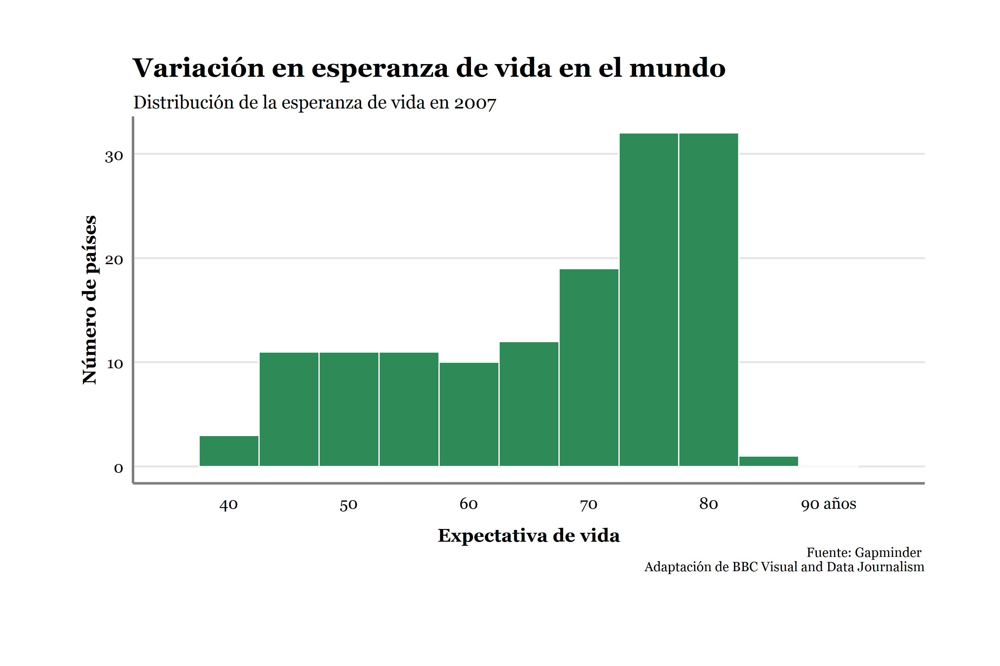
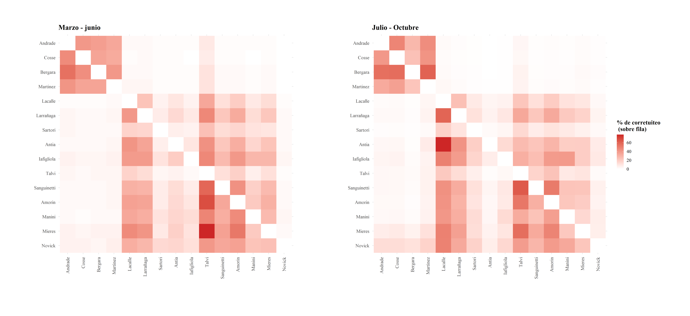
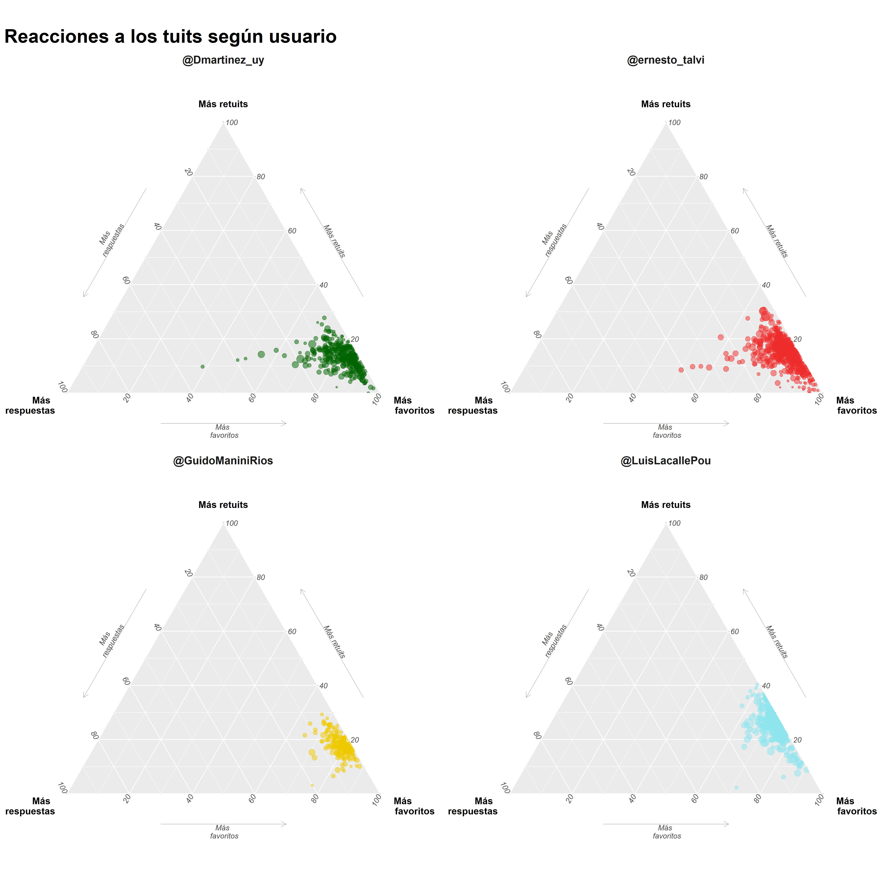
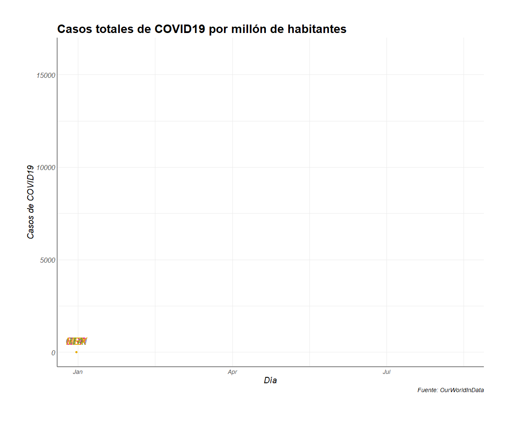
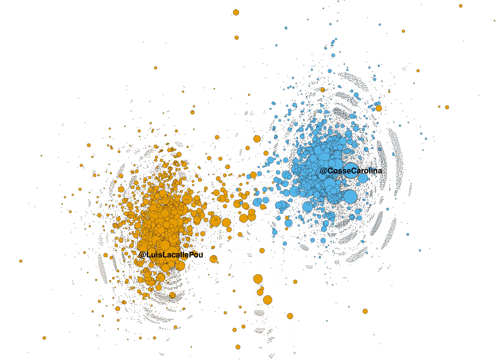
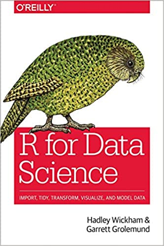
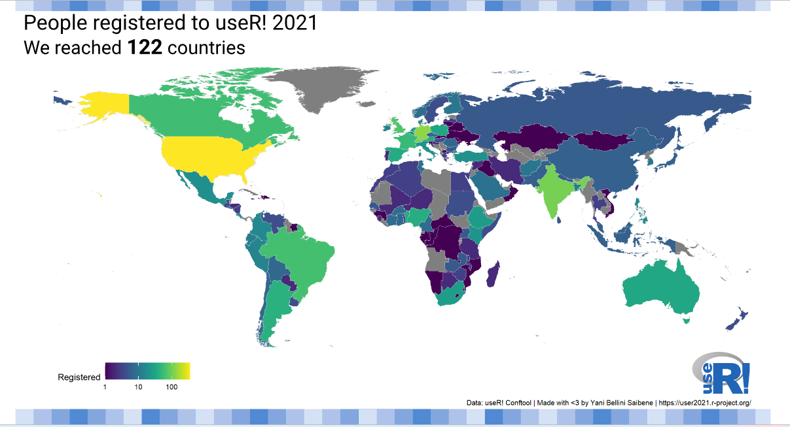
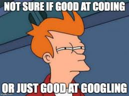
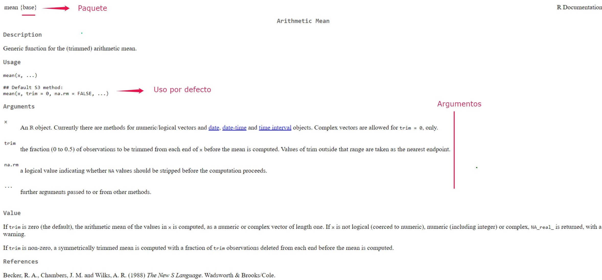
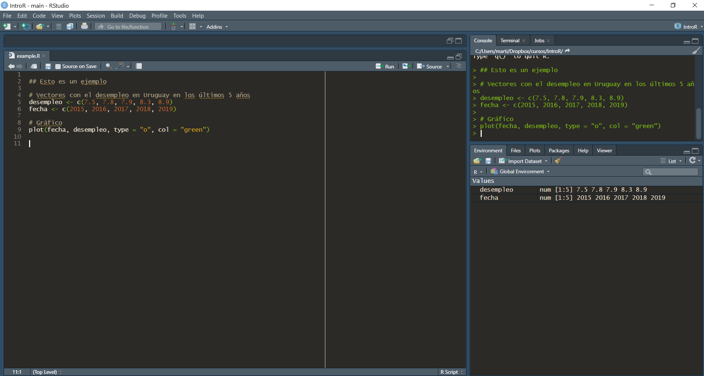

class: inverse, center, middle

```{r setup, include=FALSE}
library(xaringanthemer)
library(kableExtra)
library(xaringan)
library(xaringanExtra)

style_duo_accent(primary_color = "#8ed3f6",
                 secondary_color = "#8ed3f6",
                 text_font_family = "Droid Serif",
                 text_font_url = "https://fonts.googleapis.com/css?family=Droid+Serif:400,700,400italic",
                 header_font_google = google_font("Yanone Kaffeesatz"),
                 text_slide_number_color = "#000000")
knitr::opts_chunk$set(echo = FALSE)
options("kableExtra.html.bsTable" = T)

htmltools::tagList(
  xaringanExtra::use_clipboard(
    button_text = "<i class=\"fa fa-clipboard\"></i>",
    success_text = "<i class=\"fa fa-check\" style=\"color: #90BE6D\"></i>",
    error_text = "<i class=\"fa fa-times-circle\" style=\"color: #F94144\"></i>"
  ),
  rmarkdown::html_dependency_font_awesome()
)
use_xaringan_extra(c("tile_view", "animate_css", "tachyons"))
use_scribble()
use_extra_styles(
  hover_code_line = TRUE,         
  mute_unhighlighted_code = TRUE
  )  
```


# ¿Qué es y qué se puede hacer con R?  

---

## R y R Studio

.pull-left[

- R es un software y un lenguaje de programación gratuito enfocado en el análisis estadístico y la visualización de datos.

- R cuenta con gran potencia y flexibilidad, así como una númerosa -y creciente- comunidad de usuarios tanto académicos como profesionales.

.center[
```{r, out.width = "150px"}
knitr::include_graphics("ima/Rlogo.png")
```
]]

.pull-right[
- R Studio es un entorno de desarrollo integrado (IDE) . O en otras palabras... es una interfaz un poco (bastante) más amigable que usar R directamente.

.center[
```{r, out.width = "200px"}
knitr::include_graphics("ima/rstudio.png")
```
]]

---

## ¿Por qué usar R? 

- Es un software libre y gratuito
--

- Generar nuevas funciones es fácil, por lo que las está en constante desarrollo
--

- Tiene muchos usuarios de diversas disciplinas lo que genera una comunidad (particularmente mediante foros) que es de gran utilidad para la resolución de problemas de código
--

- Es uno de los programas más utilizados para técnicas innovadaras en estadística y visualización de datos 
--

- Trabaja muy bien con otros programas/lenguajes (Excel, Latex, HTML, etc.)
--

- Es cada vez más usado tanto en el ámbito académico como profesional
--

---
class: inverse, center, middle

# ¿Qué se puede hacer con R? 

---

## ¿Qué se puede hacer con R?

- Ingresar datos
--

- Importar y exportar datos (de Excel, Stata, documento de texto, APIs, etc)
--

- Manipular datos (recodificación, cambios de estructura)
--

- Estadística descrpitiva e inferencial
--

- Visualización de datos (gráficos de alta calidad)
--

- Técnicas estadísticas y de visualización de datos innovadoras
--

- Crear tus propias funciones y paquetes
--

- Escribir artículos y presentaciones integrando código
--

- Escribir libros
--

- Webscrapping, trabajar con Big data y machine learning
--

- Aplicaciones intercativas para visualización de datos (shiny apps)
--

- Hasta jugar videojuegos!

---

## Algunos ejemplos: visualización de datos
.center[
```{r, out.width = "750px"}

```
]
---

## Algunos ejemplos: visualización de datos
.center[
```{r, out.width = "750px"}
knitr::include_graphics("ima/ima10.png")
```
]
---

## Algunos ejemplos: visualización de datos
.center[
```{r, out.width = "750px"}

```
]
---

## Algunos ejemplos: visualización de datos
.center[
```{r, out.width = "450px"}

```
]
---

## Algunos ejemplos: visualización de datos
.center[
```{r, out.width = "600px"}

```
]
---

## Algunos ejemplos: visualización de datos
.center[
```{r, out.width = "650px"}

```
]
---


## Aplicaciones (shiny apps), paquetes y presentaciones


- [Visualizadores UMAD](https://umad.cienciassociales.edu.uy/sistema-de-consulta-personalizado/)

- [Mirador DESCA](https://bancodedatos-fcs.shinyapps.io/Mirador-DESCA-app/) 

- [OPUY](https://github.com/Nicolas-Schmidt/opuy) 

- Esta misma presentación, ver [Xaringan](https://github.com/yihui/xaringan)

- [r4ds](https://r4ds.had.co.nz/)


---
class: inverse, center, middle

# Estructura y objetivos del curso 


---

## Aspectos generales

-  Docentes: Elina Gómez, Fabricio Carneiro, Nicolás Schmidt (UMAD)

-  Créditos: 6 

-  Régimen de cursado: Presencial

-  Evaluación: 2 evaluaciones. Múltiple opción y ejercicios prácticos (presenciales)

---

## Sesiones 

- .bold[Clases 1-3: Introducción a la programación en R:]
  -  Ventajas de R y distintas aplicaciones
  -  Instalaciones, interfaz, obtener ayuda
  -  Operadores, objetos, funciones y paquetes
  -  Funciones básicas
  -  Marcos de datos (dataframes)
  -  Importar y exportar datos desde otros formatos (excel, Stata, etc.)
    
- .bold[Clases 4-5: Estadística descriptiva]
    
  -  Estadísticos descriptivos
  -  Recodificación de variables y tablas descriptivas
  -  Manipulación de datos con tidyverse (ordenar, agrupar, filtrar, resumir, etc.)
  -  Integración de bases de datos
  -  Cambios de estructura de base de datos

---

## Sesiones 

- .bold[Clases 6-8: Estadística inferencial]

  - Estimar, ordenar y visualizar modelos de regresión
    
- .bold[Clases 9-11: 4.	Visualización de datos en R y producción de documentos con RMarkdown]
  -  Análisis exploratorios con gráficos
  -  Tipos de gráficos y atributos (paletas de colores, anotaciones, etc.)
  -  Gráficos animados
  -  RMarkdown

---

## Documentos para cada sesión


Cada sesión tendrá los siguientes documentos:
- Presentación 

- Script ejemplo con el código de lo presentado

- Ejercicios sobre lo aprendido en clase

- Script con una solución para el ejercicio

Todos los materiales de curso están colgados en la página web del curso: [https://github.com/elinagomez/IntroEstadisticaR](https://github.com/elinagomez/IntroEstadisticaR) y en el [espacio EVA](https://eva.fcs.udelar.edu.uy/course/edit.php?id=1057) (Clave: introRumad) 

---

## Objetivos

1.	Familiarizar a los/as estudiantes en el aprendizaje de la estadística descriptiva e inferencial con aplicaciones en el área social. 

2.	Familiarizar a los/as estudiantes en el aprendizaje del software estadístico R para el análisis de datos a partir de estadística aplicada básica. 

3.	Introducir en las nociones básicas de visualización y producción de documentos. 

 

---
class: inverse, center, middle

# Aprendizaje

---

## ¿Qué tan difícil es aprender R?

- Al comienzo puede ser más difícil que la sintaxis básica de otros programas, particularmente porque es un lenguaje bastante distinto al resto. Sin embargo, una vez que se logra cierto entendimiento y autonomía, las posibilidades son infinitas.

- Muchas de las dificultades para aprender R se deben a sus principales ventajas: flexibilidad y potencia.

---


## Consejos
	
La curva de aprendizaje de R al comienzo suele resultar muy empinada. ¿Cómo podemos evitar o superar la frustración?
	
* **Usá** R a diario.

* **Traducí** a R una sintaxis sencilla de otro programa que conozcas.

* Recurrí a los **foros** y a la ayuda de R para encontrar las soluciones a los problemas que te surjan: stackoverflow

* Recurrí a otrxs **usuarios/as** de R que conozcas.
* Prestá atención a los **mensajes** de error y advertencia.

* **Escribí** tus sintaxis en un script y **comentalas** detalladamente.

* **Reutilizá** sintaxis existentes.

[Hoja de ayuda de R](https://raw.githubusercontent.com/rstudio/cheatsheets/master/translations/spanish/introduccion-a-r.pdf)

---


## Recursos 

Ningún recurso es en si mismo suficiente para aprender R. Cada análisis de datos es particular en su manera y las soluciones no siempre estarán en el contenido de un curso o libro específico. Hay muchos recursos para aprender R de forma general y para obtener ayuda puntual.

.center[
```{r image_grobs, fig.show = "hold", out.width = "25%", fig.align = "default"}

knitr::include_graphics("ima/sof.png")




```
]

---

## Recursos


La comunidad de usuarios de R es inmensa y muy abierta. Por esto hay muchísimos recursos para aprender de forma independiente y resolver problemas cuando nos estancamos:

- Libro "R for Data Science". Es muy completo y referencia en la mayoría de los cursos de R, pueden acceder a la versión online [original](https://r4ds.had.co.nz/) y a una [traducción](https://r4ds-en-espaniol.netlify.app/)

- [Hands On Programming with R](https://rstudio-education.github.io/hopr/basics.html) es otro libro libre muy útil sobre R  

- [R Bloggers](https://www.r-bloggers.com/) y [rpubs](https://rpubs.com/) publican miles de tutoriales para temas específicos 

- Existen foros -por ej. [Stack Overflow](https://stackoverflow.com/)- donde responden una infinidad preguntas de programación en R. 

- [IntRo](https://github.com/Nicolas-Schmidt/IntRo) es un excelente curso de R (con gran contenido teórico) de FCS-UdelaR a cargo de Nicolás Schmidt 

- [AnalizaR](https://arcruz0.github.io/libroadp/index.html) es un libro sobre análisis de datos en R con énfasis en Ciencia Política 

- [Hojas de ruta en español](https://github.com/rstudio/cheatsheets/tree/main/translations/spanish)

[Repositorio con recursos varios](https://www.rstudio.com/resources/books/)

---

## Comunidad  

* Hay una **comunidad** mundial que usa R y lo mejora constantemente, hoy hay más de 10.000 [paquetes](https://cran.r-project.org/web/packages/) disponibles para descargar

* Usuarios/as se ayudan entre sí: 
[stackoverflow](http://stackoverflow.com/questions/tagged/r),
[talkstats](http://www.talkstats.com/forumdisplay.php/14-R),
[(rusers)](\href{http://rusers.co/) y localmente [meetup R-Ladies Montevideo](https://www.meetup.com/es-ES/rladies-montevideo/). 

.center[
```{r rusers, fig.show = "hold", out.width = "80%", fig.align = "default"}



```
]
---

## Ayuda  

.center[
```{r, out.width = "500px"}

```
]

---

## Ayuda  

- Obtener la ayuda correcta es fundamental al programar en R. Podemos obtener ayuda de todas las funciones que utilizamos con el comando `help()` (ej. `help(mean)`) o `?` (ej. `?mean`)

- Si no podemos solucionar un error con la documentación de las funciones/paquetes muchas veces sirve buscar en un navegador 

- Muchas páginas contienen información relevante para solucionar problemas, entre las que se destaca [stackoverflow](https://stackoverflow.com/questions/tagged/r)

- En caso de no encontrar solución se puede consultar en páginas como stackoverflow mediante un [ejemplo reproducible o reprex](https://stackoverflow.com/questions/5963269/how-to-make-a-great-r-reproducible-example)

---

## Ayuda

```{r ej9bb2_e3, echo = TRUE, eval = FALSE}
help(mean)
```

.center[
```{r, out.width = "1000px"}

```
]

---
class: inverse, center, middle

# Primeros pasos

---

## Abrimos R Studio 
.center[
```{r, out.width = "1000px"}
knitr::include_graphics("ima/consola_standard_2.png")
```
]
---

## Personalizar R Studio (opcional)
.center[
```{r, out.width = "1000px"}

```
]

---

## R Studio

- .bold[Source (editor):] es donde creamos y editamos los scripts, es decir, donde escribimos y almacenamos el código.

- .bold[Console (consola):] imprime el código que corremos y la mayoría de los resultados. Podemos escribir código directamente aquí  también, aunque si queremos guardarlo lo recomendable es hacerlo en el script.

- .bold[Environment (ambiente):] Muestra todos los objetos que creaste en cada sesión.

- .bold[Gráficos (y más):] Imprime los gráficos. En el mismo panel figuran otras pestañas como "Help" que sirve para buscar ayuda.

---

## Scripts 

- Es un archivo de texto con el código y anotaciones. 

- Se crea arriba a la izquierda "file/New File/R Script" o `ctrl + shift + n`. 

- Se guarda con `ctrl + s` y es un documento de texto como cualquier otro (word, txt). Esto nos permite reproducir paso a paso todo lo que hicimos durante nuestro análisis.

- Haciendo click luego en el script guardado se inicia R Studio. 

- Para ejecutar una línea de código pueden usar el botón de "Run" arriba a la derecha o -más cómodo- `ctrl + enter`
     
---

## Workspace
- R nos ofrece guardar el ambiente (objetos, funciones, datos, etc.) luego de terminada cada sesión (lo que llama workspace). Si lo guardamos, la próxima vez que abramos ese script, nos encontraremos todo como lo dejamos (existirán los mismos objetos, funciones y datos). 

- Lo recomendado es NO guardar el workspace, y guardar solamente el Script. De esta forma, cuando retomemos nuestro análisis en una nueva sesión de R, podemos correrlo y chequear que efectivamente genere los que querramos.

- Pueden desactivar la pregunta en Tools - Global Options - General - desmarcando la opción "Save workspace into RData" y desmarcando "restore RData into workspace"
      
---
class: inverse, center, middle

# Lenguaje básico de R

---

## Anotaciones

- Es importante ser prolijo y cuidadoso con lo que hacemos
- Los scripts nos dan la posibilidad de anotar comentarios, lo que es muy útil:

```{r ej3, echo = TRUE}
## Esta línea es una anotación. 

## R ignora todo lo que está acá adentro (tiene que empezar con #)

## Podemos escribir nombres de funciones u objetos y R no las va a
# interpetar

## Usar anotaciones es clave para poder entender qué fue lo que
# hicimos anteriormente
```

- De esta forma, podemos comentar que fue lo que hicimos para acordarnos nosotros, y que los demás entiendan

---

## R como calculadora 

Para empezar, R sirve como calculadora. Se pueden realizar operaciones matemáticas, por ejemplo:

.codefont[
```{r ej5x, echo = TRUE}
# Operaciones sencillas
2 + 2  
20 - 10
10 / 2
10 * 10
```
]

---

## Objetos en R
En muchos programas estadísticos solemos solamente "imprimir" resultados (lo que llamamos expresiones). En R podemos utilizar este enfoque:

```{r ej5, echo = TRUE}
# Una operación sencilla:
43*47 # Se imprime el resultado
```

Sin embargo, en R también podemos almacenar los resultados en objetos. Creamos los objetos mediante asignaciones (`<-`). En este caso, guardemos el valor (a diferencia de imprimirlo). 

```{r ej5b, echo = TRUE}
year <- 43*47 # Se crea un objeto
```

Si a esto lo ponemos entre paréntesis combinamos ambos enfoques: se guarda el objeto y se imprime el resultado

```{r ej5z, echo = TRUE}
(year <- 43*47) # Se crea un objeto y se imprime
```
---

## Asignaciones 

- El símbolo para crear un objeto es ` <-` (alt + -) y se llama asignador, también se puede usar `=` pero no es recomendable.
- Las asignaciones se crean de la siguiente manera: nombre_del_objeto `<-` valor.  
- Como vimos, una vez que creo un objeto, R (por defecto) no imprime su valor. Este se puede obtener escribiendo simplemente el nombre del objeto o mediante la función `print()`:

.codefont[
```{r ej5c, echo = TRUE}
year <- 43*47 # Se crea un objeto

year # Imprime el objeto year

print(year) # Imprime el objeto year
```
]

---

## Algunos comandos básicos
```{r ej5c2, echo = TRUE, eval = FALSE}
ls() # Lista los objetos en el ambiente

rm(year) # Borra objeto del ambiente

rm(list=ls()) # Borra todos los objetos del ambiente

help(ls) # Buscar ayuda sobre una función
```

---
class: inverse, center, middle

# Objetos 

---

## Clases y tipos de objetos

- En R utilizamos constantemente objetos. Cada objeto tiene una clase, tipo y atributos. 

- Esto es importante porque las funciones que podemos aplicar a nuestros datos dependen del objeto en el que los definimos.

- El uso de objetos tiene muchos benificios como extraer parte de ellos para determinados usos, duplicarlos o realizar operaciones sin imprimir en la consola.

---

## Tipos de objetos

El tipo de un objeto refiere a cuál es el tipo de los datos dentro del objeto. Los tipos más comunes son:
 
```{r t1, echo = FALSE, results="hide"}
Nombre <- c("integer", "double", "character", "logical")
Tipos <- c("Númerico: valores enteros", "Númerico: valores reales", "Texto", "Lógico (TRUE or FALSE)")
Ejemplo <- c(10, 10.5, "Diez", TRUE)
tabla1 <- data.frame(cbind(Nombre, Tipos, Ejemplo))
```
 
```{r t1_c, echo = FALSE}
tabla1 %>%
  kbl() %>%
  kable_styling(bootstrap_options = c("striped", "hover", "condensed"), font_size = 20)
```

---

## Clases o estructura de datos

Las clases de objetos son formas de representar datos para usarlos de forma eficiente. Se dividen en cuántas dimensiones tienen y si poseen distintos tipos de datos o no. Las clases de datos más comunes en R son: 

- `vector` (vectores): es la forma más simple, son unidimensionales y de un solo tipo

- `lists` (listas): son unidimensionales pero no están restringidas a un solo tipo de datos

- `matrix` (matrices): tienen dos dimensiones (filas y columnas) y un solo tipo de datos. 

- `dataframes` (marcos de datos): son el tipo de estructura al que más acostumbrado estamos, con dos dimensiones (filas y columnas) y puede incluir distintos tipos de datos (uno por columna). Pueden considerarse como listas de vectores con el mismo tamaño. 


En ocasiones podemos transformar objetos de una clase a otra.


---
## Clases y tipos de objetos

.center[
```{r ej5434, out.width = "800px"}
knitr::include_graphics("ima/sch.jpg")
```
]

.right[ R variables and data types: Introduction to R Programming, Sydney-Informatics
]


---

## Funciones para explorar objetos

R tiene funciones que nos permiten identificar la clase, el tipo, la estructura y los atributos de un objeto.

- `class()` - ¿Qué tipo de objeto es?

- `typeof()` - ¿Qué tipos de data tiene el objeto?

- `length()` - ¿Cuál es su tamaño?

- `attributes()` - ¿Tiene metadatos?

---

## Clases y tipos de objetos

```{r ej7, echo = TRUE}
  # Creamos algunos objetos distintos
  year <- 2021
  nombre <- "Dos mil veintiuno"
  
  # Uso la función class para averiguar la clase de objeto
  class(year) 
  class(nombre)
  
  # Uso la función typeof para averiguar el tipo de la data del objeto
  typeof(nombre)
  
```

---

## Clases y tipos de objetos

Todo lo que escribimos entre comillas se interpeta como texto, por más que sean números. 

```{r ej7_b, echo = TRUE}
  year_2 <- "2021"

  class(year_2)
  
  vof <- TRUE
  class(vof) 
```
  
---

## ¿Por qué importan los tipos y clases? 
Supongamos que creamos un objeto con el valor 10, al que luego le sumaremos otro objeto con el valor 20. 

```{r ej7b2, echo = TRUE, error=TRUE}
obj_1 <- "10"

class(obj_1)
obj_1 + 20 # Da error
```

---

## ¿Por qué importan los tipos y clases? 
En cambio, si creamos el objeto de tipo númerico:

```{r ej7b3, echo = TRUE}
obj_1 <- 10

class(obj_1)
obj_1 + 20 # Funciona
```

---

## ¿Por qué importan los tipos y clases? 
Normalmente no trabajamos con objetos de un solo valor, y reescribirlos no es una opción. Para ellos tenemos coercionadores `as.logical()`, `as.integer()`, `as.double()`, o `as.character()`: funciones que transforman un objeto de un tipo a otro. En este caso:
```{r ej7b32, echo = TRUE, error=TRUE}
obj_1 <- "10"

class(obj_1)

obj_1 <- as.numeric(obj_1)
class(obj_1)
is.numeric(obj_1) # Podemos verificarlo directamente también
```

---
class: inverse, center, middle

# Vectores

---

## Vectores 
Un vector es una colección de elementos. Los vectores atómicos son los que contienen elementos todos del mismo tipo (que es lo más normal en el análisis de datos). Hay 4 tipos de vectores: lógicos, character, integer y double (estos dos últimos son numéricos). Los elementos determinarán el tipo del objeto. Crear un vector es muy sencillo mediante la función `c()`:

.codefont[
```{r ej7b35a, echo = TRUE}
mi_primer_vector <- c(1, 3, 5, 7, 143) 
print(mi_primer_vector)
class(mi_primer_vector)
length(mi_primer_vector)
str(mi_primer_vector)
```
]

---

## Vectores 

.codefontchico[
```{r ej7b35, echo = TRUE}
v1 <- c(1:5) # Todos los números de 1 a 5
v1
v2 <- seq(0, 50, 10) # De 0 a 50 de a 10 números
v2
v3 <- c(v1, v2) # Combino vectores creando un nuevo vector
v3
v4 <- c("rojo", "verde", "blanco") # character
v4
v5 <- c(TRUE, TRUE, FALSE, TRUE) # lógico
v5
```
]

---

## Indexación 
Cuando queremos referirnos a uno o varios elementos dentro de un vector utilizamos `[]` (indexación).
```{r ej7b35b, echo = TRUE}
## Indexación:
v2
v2[1] # El primer elemento dentro del vector 
# Nos sirve por ejemplo para extraer partes del vector:
v3 <- v2[1:3] # Creo nuevo vector con los elementos del 1 al 3
v3
```

---

## Operaciones con vectores

También podemos realizar operaciones con los vectores númericos:
```{r ej7b35c, echo = TRUE}
## Operaciones con vectores:
v3
v3 + 2 # Se realiza la operación sobre cada elemento del vector
```

---

## Coerción 

¿Qué pasa si unimos vectores de distinto tipo? 

Si unimos un vector de tipo caracter con uno númerico, R convertirá todo el vector a caracter. Si unimos un vector númerico (double o integer) a lógico, R convertirá el vector en númerico (`TRUE = 1`, `FALSE = 0`)

```{r ej7b35d, echo = TRUE}
## Ejemplo de coerción automática:
v2 <- seq(0, 50, 10) # De 0 a 50 de a 10 números
v4 <- c("rojo", "verde", "blanco") # character
v6 <- c(v2, v4)
v6
class(v6)
```

