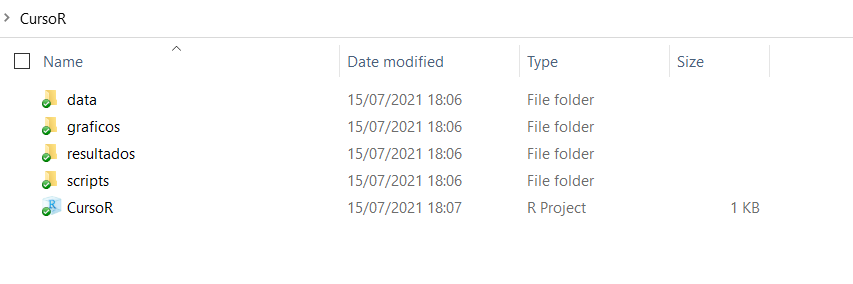

class: inverse, center, middle

```{r setup, include=FALSE}
library(xaringanthemer)
library(kableExtra)
library(xaringan)
library(xaringanExtra)

style_duo_accent(primary_color = "#8ed3f6",
                 secondary_color = "#8ed3f6",
                 text_font_family = "Droid Serif",
                 text_font_url = "https://fonts.googleapis.com/css?family=Droid+Serif:400,700,400italic",
                 header_font_google = google_font("Yanone Kaffeesatz"),
                 text_slide_number_color = "#000000")
knitr::opts_chunk$set(echo = FALSE, warning = FALSE, error = FALSE)
options("kableExtra.html.bsTable" = T)

htmltools::tagList(
  xaringanExtra::use_clipboard(
    button_text = "<i class=\"fa fa-clipboard\"></i>",
    success_text = "<i class=\"fa fa-check\" style=\"color: #90BE6D\"></i>",
    error_text = "<i class=\"fa fa-times-circle\" style=\"color: #F94144\"></i>"
  ),
  rmarkdown::html_dependency_font_awesome()
)
use_xaringan_extra(c("tile_view", "animate_css", "tachyons"))
use_scribble()
use_extra_styles(
  hover_code_line = TRUE,         
  mute_unhighlighted_code = TRUE
  )  
```


# Directorios de trabajo y proyectos de R (.Rproj)

---

## Directorios de trabajo 
- Para abrir en R un archivo guardado en tu computadora, debes especificar en qué carpeta está guardado, para esto hay varias opciones. Primero, puedes fijar un directorio por defecto:

.codefont[
```{r ej4, echo = TRUE, results = "hide", error=TRUE, eval = FALSE}
# Puedo fijar el directorio de trabajo con la función setwd()
# Fijar la carpeta donde vamos a importar y exportar los archivos:
setwd("micompu/micarpeta") 
getwd() # Con está función puedo consultar el directorio
```
]

.codefont[
```{r ej5, echo = TRUE, error=TRUE}
# Ahora, si quiero leer un archivo que esté en "micompu/micarpeta" simplemente 
# escribo su nombre dentro de la función, en el lugar del "path".

# Supongamos que tengo dentro de la carpeta "micarpeta" un excel con datos
# de desempleo en Uruguay:

library(readxl)
desempleo_uru <- read_excel("data/desempleo.xlsx")
head(desempleo_uru, 4)
```
]
---

## Directorios de trabajo 
También podemos no fijar un directorio para la sesión e ir especificando los directorios completos dentro de cada función:

```{r ej6, echo = TRUE, error=TRUE, results = "hide", eval = FALSE}
desempleo_uru <- read_excel("micompu/micarpeta/data/desempleo.xlsx")
```

---

## Proyectos de R (.Rproj)

- La mejor práctica para que nuestros scripts sean portables y reproducibles, es utilzar R Projects (`.Rproj`). 

- Para crear un `.Rproj` vamos a `File/New Project` y ahí nos encontramos con la opción de crear una carpeta para guardar los archivos o utilizar una carpeta ya existente.

- Al crear un proyecto de R se creará un archivo de extensión `.Rproj`, cuando le damos click se inicia una nueva sesión de R cuyo directorio es por defecto la carpeta en la que está guardado. 

- Podemos usar directorios relativos dentro de la carpeta en la que se aloja nuestro `.Rproj` para importar y exportar datos a y desde R. Esto hace que uno pueda cambiar la carpeta o compartirla y el script correrá de igual manera (a diferencia de si utilizamos `setwd()`)

---

## Proyectos de R (.Rproj) 
<ol>
<li> Creen una carpeta para guardar el material del curso 
<li> Descarga de la webasignatura las carpetas "Data" y las carpetas "scripts" de los días 1 y 2. Pegalas en la carpeta del punto 1 (guarda todos los scripts dentro de la misma carpeta)
<li> Crea además dos carpetas más dentro de tu carpeta: "graficos" y "resultados"
<li> Abran RStudio y desde ahí creen un `.Rproj`, desde existing directory, seleccionando la carpeta del punto 1
</ol>

.center[
```{r ej7, out.width = "700px"}
knitr::include_graphics("ima/rproj.png")
```
]
---

## Proyectos de R (.Rproj) 
<ol start=5>
<li> Deberían ver en su carpeta algo así:
</ol>

.center[
```{r ej7_b, out.width = "1000px"}

```
]

---

## Proyectos de R (.Rproj)
<ol start=6>
<li> Abran el archivo `.Rproj` y desde ahí usando File/Open File abren los scripts dentro de la carpeta "scripts". Es importante que los abran desde la sesión que inicia el proyecto y no directamente haciendo click en el script.
<li> Ya estamos listos para empezar!
</ol>

---
class: inverse, center, middle

# Dialectos

---
## Ejercicio

.content-box-blue[
*Supongamos que tengo estos datos:*
]

```{r ej2a, echo = FALSE, results='hide'}
library(readxl)
library(tidyverse)
library(data.table)
datauru <- read_excel("data/datauru.xlsx")
data <- select(datauru, year, gdp_lcu, inflation, unemployment, presidente)
```

```{r ej2b, echo = TRUE}
data
```
---

## Ejercicio

.content-box-blue[
*¿Qué quiero hacer con el código debajo?*
]

.codefont[
```{r ej2c, echo = TRUE, eval = FALSE}
as.data.frame(t(sapply(X = split(
  x = data[which(data$presidente %in% c("Vázquez", "Sanguinetti")),
           which(colnames(data) %in% c("gdp_lcu", "inflation"))],
  f = data$presidente[which(data$presidente %in% c("Vázquez", "Sanguinetti"))],
  drop = TRUE),
  FUN = function(x) {apply(x, 2, mean)})))
```
]

---
## Ejercicio

.content-box-blue[
*¿Qué quiero hacer con el código debajo?*
]

```{r ej2e, echo = TRUE, eval = FALSE}
data_dt <- data

setDT(data_dt)

data_dt[presidente %in% c("Vázquez", "Sanguinetti"),
       c("presidente", "gdp_lcu", "inflation")  ][
         , lapply(.SD, mean), by = presidente]
```

---
## Ejercicio

.content-box-blue[
*¿Qué quiero hacer con el código debajo?*
]

```{r ej2d, echo = TRUE, eval = FALSE}
data %>%
  filter(presidente %in% c("Vázquez", "Sanguinetti")) %>%
  select(presidente, gdp_lcu, inflation) %>%
  group_by(presidente) %>%
  summarise_all(mean)

```

---
## R Base

```{r ej2f, echo = TRUE}
as.data.frame(t(sapply(X = split(
  x = data[which(data$presidente %in% c("Vázquez", "Sanguinetti")),
           which(colnames(data) %in% c("gdp_lcu", "inflation"))],
  f = data$presidente[which(data$presidente %in% c("Vázquez", "Sanguinetti"))],
  drop = TRUE),
  FUN = function(x) {apply(x, 2, mean)})))
```

---
## Data.table

```{r ej2g, echo = TRUE}
data_dt <- data
setDT(data_dt)
data_dt[presidente %in% c("Vázquez", "Sanguinetti"),
       c("presidente", "gdp_lcu", "inflation")  ][
         , lapply(.SD, mean), by = presidente]
```

---
## Tidyverse

```{r ej2h, echo = TRUE}
data %>%
  filter(presidente %in% c("Vázquez", "Sanguinetti")) %>%
  select(presidente, gdp_lcu, inflation) %>%
  group_by(presidente) %>%
  summarise_all(mean)

```

---

## Dialectos

- En R podemos realizar una misma operación de muchas maneras distintas. Puesto de otra manera, R como lenguaje de programación tiene distintos "dialectos", esto es, paquetes (o conjuntos de paquetes) con sus propias funciones, sintaxis y comunidad de usuarios. 

- Para la mayoría de las funciones requeridas para un análisis de datos estándar (importar datos, manipular, modelar y visualizar) existen -de forma muy simplificada- tres grandes dialectos: [R Base](https://stat.ethz.ch/R-manual/R-devel/library/base/html/00Index.html), [tidyverse](https://www.tidyverse.org/) y [data.table](https://rdatatable.gitlab.io/data.table/).

- Tidyverse es una colección de paquetes diseñados para el análisis de datos. Este conjunto de paquetes comparte una filosofía de diseño, grámatica y estructura de datos. 

- Las ventajas de Tidyverse están en su gramática (fácil de leer lo que invita a compartir y replicar), consistencia, alcance y su numerosa y creciente comunidad.

```{r ej1, echo = FALSE, results='hide'}
encuesta <- data.frame(edad = c(18,24,80), 
                       ideologia = c("Izquierda", "Izquierda", "Derecha"),
                       voto = c("Partido A", "Partido A", "Partido C"))
```

---

## Dialectos (ejemplo) 

.codefontchico[
```{r ej2, echo = TRUE}
encuesta # Retomemos el data.frame "encuesta"
# Supongamos que quiero quedarme solo con las variables de edad y voto

encuesta_base <-  encuesta[ , c("edad", "voto")] # R Base
colnames(encuesta_base)
encuesta_dt <- as.data.table(encuesta)[ , .(edad, voto)] # Datatable
colnames(encuesta_dt)
encuesta_tidy <- select(encuesta, edad, voto) # Tidyverse
colnames(encuesta_tidy)
```
]
---
class: inverse, center, middle

# Tidyverse

---

## Tidyverse 


Tidyverse cuenta con varios paquetes que sirven para distintos tipos de tareas específicas. Podemos cargar todos los paquetes de forma conjunta: 

.codefont[
```{r ej00, echo = TRUE, results='hide', error=TRUE}
 # install.packages("tidyverse")
library(tidyverse)

# install.packages("dplyr")
library(dplyr)
```
]

.center[
```{r ej0, out.width = "200px"}
knitr::include_graphics("ima/tidy.jpg")
```
]
---

## Tidyverse 
La mejor manera de entender los principios de tidyverse es a través del libro del creador de tidyverse (Hadley Wickham) y Garrett Grolemund "R for Data Science" (2018). 

.center[
```{r ej0_b, out.width = "600px"}
knitr::include_graphics("ima/tidy_pr.png")
```
]

---

## Tidyverse: paquetes 

.pull-left[Paquetes que Tidyverse carga: 

- [readr](https://readr.tidyverse.org/): importar y exportar datos
- [dplyr](https://dplyr.tidyverse.org/): manipulación de datos
- [tidyr](https://tidyr.tidyverse.org/): manipulación de datos
- [ggplot2](https://ggplot2.tidyverse.org/): visualización de datos
- [purr](https://purrr.tidyverse.org/): programación avanzada
- [tibble](https://tibble.tidyverse.org/): estructura de datos
- [forcats](https://forcats.tidyverse.org/): factores
- [stringr](https://stringr.tidyverse.org/): variables de caracteres
]

.pull-right[
```{r ej0_a, out.width = "500px"}

```
]
---

## Tidyverse: paquetes
Estos son algunos paquetes (para tareas más específicas) que forman parte del Tidyverse pero se tienen que cargar por separado:

- [readxl](https://readxl.tidyverse.org/): importar datos (excel)
- [haven](https://haven.tidyverse.org/): importar (Stata, SPSS, SAS)
- [lubridate](https://lubridate.tidyverse.org/): manipulación de fechas
- [rvest](https://rvest.tidyverse.org/): webscrapping
- [glue](https://www.tidyverse.org/blog/2017/10/glue-1.2.0/): combinar data
- [tidymodels](https://www.tidymodels.org/): modelar datos


---
class: inverse, center, middle

# Importar y exportar datos

---

## Importar datos
- Hasta ahora trabajamos principalmente con datos ingresados manualmente con las funciones `c()` y `data.frame()`

- Normalmente cuando trabajamos con datos solemos utilizar datos ya creados guardados en los formatos de otros programas (ej. Excel, Stata, SPSS) 

- Existen varios paquetes que permiten importar y exportar datos desde distintos formatos. Algunos de los más utilizados son [readr](https://readr.tidyverse.org/), [haven](https://haven.tidyverse.org/), [readxl](https://readxl.tidyverse.org/) y [utils](https://www.rdocumentation.org/packages/utils/versions/3.6.2)

---

## Importar datos 
Distintas funciones nos sirven para importar datos a R desde distintos formatos. Veamos algunos ejemplos:

.codefont[
```{r ej8, echo = TRUE, results="hide", message=FALSE, warning=FALSE}
# Con la función read_csv() del paquete readr importamos archivos .csv
library(tidyverse)
gapminder_csv <- read_csv("data/gapminder.csv")

# Con la función read_excel() del paquete readxl importamos archivos excel
library(readxl)
gapminder_excel <- read_excel("data/gapminder.xlsx")

```
]

.codefont[
```{r ej8_b, echo = TRUE}
# Vemos que los dataframes son iguales, tienen la mismas filas y columnas
dim(gapminder_csv)
dim(gapminder_excel)
```
]
---

## Importar datos
Algunos paquetes incluyen datos, por ejemplo, gapminder. En la documentación del paquete se encuentra el nombre de los datos. Con una simple asignación los podemos cargar 
```{r ej9, echo = TRUE, message=FALSE, warning=FALSE}
library(gapminder)

data_gapminder <- gapminder
head(data_gapminder)
```

---

## Importar datos
También es posible importar datos guardados en los formatos de otros softwares estadísticos como SPSS o Stata. Para esto usaremos el paquete haven.

.codefont[
```{r ej10, echo = TRUE}
library(haven)

# SPSS
gapminder_spss <- read_spss("data/gapminder.sav") 

# STATA
gapminder_stata <- read_stata("data/gapminder.dta") 
```
]

O podríamos llamar a la función y paquete dado que generalmente solo utilizamos una función de los paquetes que cargan datos (depende del caso obviamente)

.codefont[
```{r ej10bb, echo = TRUE}
# SPSS
gapminder_spss <- haven::read_spss("data/gapminder.sav") 

# STATA
gapminder_stata <- haven::read_stata("data/gapminder.dta") 
```
]

---

## Importar datos 
R también cuenta con sus propios formatos de almacenamiento de datos (`.rds` y `.Rdata` o `.rda`). Este enfoque es poco práctico si queremos usar los datos almacenados en otro programa, pero muy útil si solamente usaremos R dado que mantiene la información tal cual estaba en R (por ej. tipos de variables o atributos):

.codefont[
```{r ej11, echo = TRUE}
# Para esto no necesitamos cargar paquetes. 
# Guardar un objeto como .rds:
saveRDS(object = data_gapminder,
        file = "resultados/data_gapminder.rds") 

 # Leemos un archivo .rds
miobjeto_rds <- readRDS(file = "resultados/data_gapminder.rds")

# Con .rda se pueden guardar varios objetos al mismo tiempo!
# Exportamos un archivo .Rdata
save(data_gapminder, miobjeto_rds,
     file = "resultados/dos_dataframes.Rdata") 

 # Importamos un archivo .Rdata
load("resultados/dos_dataframes.Rdata")
```
]

---

## Exportar datos 
- También podemos guardar archivos desde R en otros formatos. 
- Con [readr](https://readr.tidyverse.org/) podemos exportar archivos en formato .csv 
- Con [writexl](https://cran.r-project.org/web/packages/writexl/writexl.pdf) podemos exportar directamente un excel.
- Con [haven](https://www.rdocumentation.org/packages/haven/versions/2.3.1) podemos exportar achivos en formato .dta (Stata) y .sav (SPSS)

.codefont[
```{r ej12, echo= FALSE}
# Guardar .csv
library(gapminder)
data_gapminder <- gapminder
write_excel_csv(data_gapminder, "resultados/gapminder.csv")

# Guardar excel
library(writexl)
write_xlsx(data_gapminder, "resultados/gapminder.xlsx")

# Guardar .dta (Stata)
library(haven)
write_dta(data_gapminder, "resultados/gapminder.dta")

# Guardar .sav (SPSS)
write_sav(data_gapminder, "resultados/gapminder.sav")

# Guardar .sas (SAS)
write_sas(data_gapminder, "resultados/gapminder.sas")
```
]
---

## Importar y exportar datos

.bold[Argumentos a tener en cuenta:]

- .bold[Nombre de columnas:] a veces debemos especificar si queremos que la primera fila de nuestros datos sean el nombre de las variables

- .bold[Nombre de filas:] de igual manera, a veces podemos especificar si queremos que la primera columna sea el nombre de las filas (sirve para identificadores de caso por ej.)

- .bold[Etiquetas de variables:] cuando los datos que queremos importar tienen etiquetas (pasa mucho en encuestas) podemos cargarlas como etiquetas o cargar solamente la etiqueta como cadena o factores. Ver capítulo 4 de Urdinez, F. & Labrin, A. (Eds.) (2020)

- .bold[Append:] algunas funciones permiten agregar filas debajo de un archivo (esto es muy útil para ir actualizando bases de datos)

---

## Etiquetas cuando importamos datos

- Cuando importamos datos que tienen etiquetas (por ejemplo de formatos como Stata o SPSS) debemos tener cuidado con cómo manejar estas etiquetas

- Por ejemplo, supongamos que queremos leer los datos de una encuesta con dos variables, guardada en formato Stata (`.dta`), con el paquete `haven`.

<!-- .codefont[ -->
<!-- ```{r ej13bb, eval = FALSE} -->
<!-- data <- haven::read_stata("data/ej_encuesta.dta") -->
<!-- head(data, 5) -->
<!-- ``` -->
<!-- ] -->

- Por defecto se leen como variables de tipo `double` (numérica) con etiquetas como atributos

- Si queremos quedarnos directamente coon las etiquetas, podemos utilizar la funcion `as_factor`.
---

## Importar y exportar datos: factores

- Otro tipo de variables en R son los factores (factors), utilizados para representar data categórica. Estos suelen confundirse con las variables de caracteres pero tienen algunas diferencias. 

- Normalmente los factores son utilizados para las variables de caracteres con un número de valores posibles fijo y cierto orden (opcional)

- A R le gusta transformar las variables de caracteres en factores al importarlas (si usamos R Base particularmente).

- El paquete [forcats](https://forcats.tidyverse.org/) (dentro del Tidyverse) ayuda a manejar variables de caracteres y factores:
    - `fct_relevel()` cambia manualmente el orden de los niveles
    - `fct_reoder()` cambia el orden de los niveles de acuerdo a otra variable
    - `fct_infreq()` reordena un factor por la frecuencia de sus valores 
    - `fct_lump()` collapsa los valores menos frecuentes en otra categoría "other". Es muy útil para preparar datos para tablas y gráficos
---

## Importar y exportar datos: factores 

.codefontchico[
```{r ej13, echo = TRUE}
# Podemos chequear y coercionar factores
data_gapminder <- gapminder
is.factor(data_gapminder$continent) # Chequeo si es factor
levels(data_gapminder$continent) # Chequeo los niveles
# Transformo a caracter
data_gapminder$continent <- as.character(data_gapminder$continent) 
class(data_gapminder$continent)
# De vuelta a factor
data_gapminder$continent <- as.factor(data_gapminder$continent)
class(data_gapminder$continent)
```
]

---

## Importar y exportar datos: factores 

.codefont[
```{r ej14, echo = TRUE}
# Para crear un factor usamos la función factor()
paises_mercosur <- factor(c("Argentina", "Brasil", "Paraguay", "Uruguay"))
table(paises_mercosur)
# La función fct_relevel() nos permite reordenar los niveles del factor
paises_mercosur <- fct_relevel(paises_mercosur, "Uruguay")
table(paises_mercosur)
```
]

---

## Ejercicio

.content-box-blue[
*(1) En la carpeta data encontrarán un archivo excel llamado "urudata_sheets", leer el archivo en R*

*(2) Leer la segunda hoja del archivo*
]

---
class: inverse, center, middle

# Dataframes 

---

## Dataframes: tibbles
- La mayoría de los análisis de datos convencionales contienen dataframes. Cuando usamos los paquetes del tidyverse, generalmente trabajamos con "tibbles", que es muy similar a un dataframe pero con pequeños cambios. 

- Una de las principales diferencias es la forma en que se imprimen los datos.

- La mayoría de las funciones del Tidyverse devuelven un tibble.

.codefont[
```{r ej15, echo = TRUE}
data_gapminder <- (gapminder)
class(data_gapminder) # Ya es un tibble 
data_gapminder <- as.data.frame(data_gapminder)
class(data_gapminder) # Ahora solamente dataframe
```
]

---

## Dataframes: imprimir dataframe 

.codefont[
```{r ej15b, echo = TRUE}
print(data_gapminder)
```
]
---

## Dataframes: imprimir tibble 

.codefont[
```{r ej16, echo = TRUE}
data_gapminder <- as_tibble(data_gapminder) # Pasamos nuevamente a tibble
class(data_gapminder)
print(data_gapminder)
```
]

---

## Tidy dataset
- Hay muchas formas de estructurar un conjunto de datos. El enfoque tidy sugiere que cada variable sea una columna y cada observación sea una fila, por lo que cada valor tiene su propia celda:

.center[
```{r ej17, out.width = "1000px"}
knitr::include_graphics("ima/tidy_data.png")
```
]

.right[[Wichkham & Grolemund (2018)](https://r4ds.had.co.nz/tidy-data.html)]

---

## Nombres de variables

Muchas veces los usamos datos que no están documentados de manera uniforme o apropiada, por ejemplo, con nombres dispares y propensos a errores en las columnas.

[Janitor](https://garthtarr.github.io/meatR/janitor.html#catalog_of_janitor_functions) es un paquete orientado al estilo Tidyverse (aunque no pertenece) que facilita algunas funciones para limpiar y explorar datos. 

```{r ej17_a, results='hide', echo=FALSE}
ejemplo <- data.frame(COLORES = c("Verde", "Rojo", "Azul"),
                      NombresCompletos = c("María S.", "Juan F.", "Pedro A."),
                      edad_NUMERICA = c(32, 23., 24))
```

.codefont[
```{r ej17_b, warning=FALSE, message=FALSE, echo = TRUE}
ejemplo

library(janitor)

ejemplo_clean <- clean_names(ejemplo)
ejemplo_clean
```
]


